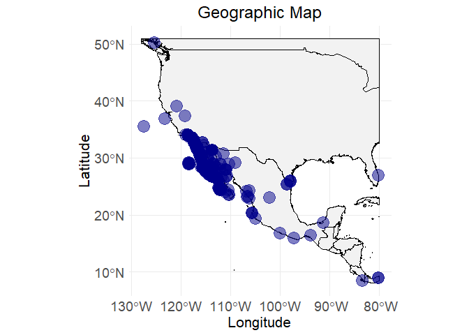
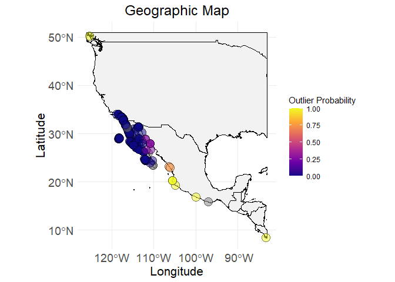
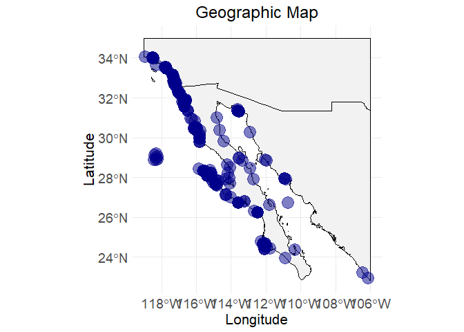

<!-- README.md is generated from README.Rmd. Please edit that file -->

# EcoCleanR V1.0

<!-- badges: start -->
<!-- badges: end -->

**The goal of EcoCleanR is to provides functions to integrate
biodiversity data from multiple aggregates and offers a step-by-step
framework for data cleaning, outlier detection, and the generation of
species biogeographic ranges. It also supports the extraction of
relevant environmental information to assist in ecological and
biogeographic analyses.**

Key features:<br>

1.  Data Merging: Merge data from GBIF (with *rgbif*), iDigBio (with
    *ridigbio*), OBIS (with *robis*), InvertEBase (with *rsymbiota*),
    and local input data files (with read.csv local drive). <br>
2.  Data Cleaning: <br> 2.1. Remove duplicates<br> 2.2. Check bad taxon
    using WoRMs<br> 2.3. Improve the coordinate information utilizing
    external georeference tools. 2.4. check the coordinate precision and
    rounding<br> 2.5. Flag the records associated wrong ocean/sea and
    inland 2.6. Extract the environmental variables<br> 2.7. Impute the
    environmental variables if no assignment from online resources.<br>
    2.8. Identifying outliers<br>
3.  Data visualizing: <br> 3.1. Create map view<br> 3.2. Execute a
    summary table with max, min and mean limits of variables<br> 3.3.
    Create a summary and plot to represent suitable range of a species
    for spatial and non spatial attributes<br>

## Installation from GitHub

You can install the development version of EcoCleanR from
[GitHub](https://github.com/) with: <https://github.com/xxx/EcoCleanR/>

``` r
# install.packages("devtools")
devtools::install_github("xxx/EcoCleanR")
```

## Example

This is a basic example which shows you how to solve a common problem:

``` r
library(EcoCleanR)
## basic example code
# After execution of step 1 and 2.1, output file called "ecodata"
# This dataset contains ~1100 occurrence records for the species Mexacanthina lugubris. It was compiled by merging data from multiple online repositories — GBIF, OBIS, iDigBio, InvertEBase — along with personal field observations (step 1). Duplicate records were removed to retain only unique occurrences (2.1).
# The algorithm for these steps can be found on article folder - documentation
head(ecodata)
#>   X basisOfRecord occurrenceStatus institutionCode
#> 1 1        modern          PRESENT     iNaturalist
#> 2 2        modern          PRESENT             CAS
#> 3 3        modern          PRESENT     iNaturalist
#> 4 4        modern          PRESENT             CAS
#> 5 5        modern          PRESENT     iNaturalist
#> 6 6        modern          PRESENT              LI
#>                         verbatimEventDate
#> 1 Tue Nov 02 2021 12:32:42 GMT-0700 (PDT)
#> 2                             02 Jan 1975
#> 3 Sat Nov 13 2021 14:00:19 GMT-0800 (PST)
#> 4                             01 Jan 1975
#> 5                  2021/03/19 3:34 PM CDT
#> 6                                    <NA>
#>                                scientificName individualCount organismQuantity
#> 1 Mexacanthina lugubris (G.B.Sowerby I, 1822)              NA               NA
#> 2 Mexacanthina lugubris (G.B.Sowerby I, 1822)              NA               NA
#> 3 Mexacanthina lugubris (G.B.Sowerby I, 1822)              NA               NA
#> 4 Mexacanthina lugubris (G.B.Sowerby I, 1822)              NA               NA
#> 5 Mexacanthina lugubris (G.B.Sowerby I, 1822)              NA               NA
#> 6       Acanthina tyrianthina S.S.Berry, 1957              NA               NA
#>   abundance decimalLatitude decimalLongitude coordinateUncertaintyInMeters
#> 1        NA        33.51358        -117.7583                            65
#> 2        NA              NA               NA                            NA
#> 3        NA        32.81539        -117.2741                            83
#> 4        NA              NA               NA                            NA
#> 5        NA        32.67190        -117.2455                            12
#> 6        NA              NA               NA                            NA
#>                                                                                   locality
#> 1                                                                                     <NA>
#> 2    Pacific Ocean, Guadalupe Island [Isla Guadalupe], Old Sealer's Cove, intertidal pools
#> 3                                                                                     <NA>
#> 4 Pacific Ocean, Guadalupe Island [Isla Guadalupe], Old Sealer's Cove, bare rocks, exposed
#> 5                                                                                     <NA>
#> 6                                                     La Bujadera, Baja California, Mexico
#>                            verbatimLocality municipality county stateProvince
#> 1 North Pacific Ocean, Laguna Beach, CA, US           NA   <NA>    California
#> 2                                      <NA>           NA   <NA>          <NA>
#> 3               North Pacific Ocean, CA, US           NA   <NA>    California
#> 4                                      <NA>           NA   <NA>          <NA>
#> 5                        San Diego, CA, USA           NA   <NA>    California
#> 6                                      <NA>           NA   <NA>          <NA>
#>                    country cleaned_catalog
#> 1 United States of America       100088422
#> 2                   Mexico            1001
#> 3 United States of America       101101719
#> 4                   Mexico            1016
#> 5 United States of America       101984642
#> 6 United States of America       102083202

# visualizing the raw data
ec_geographic_map(ecodata)
#> Warning: Removed 358 rows containing missing values or values outside the scale range
#> (`geom_point()`).
```



``` r

# lets execute cleaning steps
# step 2.2 - check taxon error for species name - "Mexacanthina lugubris"
comparison <- ec_worms_synonym("Mexacanthina lugubris", ecodata)
#> ══  1 queries  ═══════════════
#> 
#> Retrieving data for taxon 'Mexacanthina lugubris'
#> ✔  Found:  Mexacanthina lugubris
#> ══  Results  ═════════════════
#> 
#> • Total: 1 
#> • Found: 1 
#> • Not Found: 0
# step 2.3 - check records with locality but no coordinate assignments
ecodata$flag_with_locality <- ec_flag_with_locality(ecodata)
# upload back the corrected file with csv upload - name it as ecodata_corrected
head(ecodata_corrected)
#>   cleaned_catalog corrected_latitude corrected_longitude corrected_uncertainty
#> 1            1001           29.03741           -118.3182                 19180
#> 2            1016           29.03741           -118.3182                 19180
#> 3       102443960           32.72160           -117.2112                 23582
#> 4       104087711           32.66767           -117.2452                  1771
#> 5       104911613           32.72160           -117.2112                 23284
#> 6       105885508           32.83330           -117.2667                  2962
ecodata <- ec_merge_corrected_coordinates(ecodata_corrected, ecodata)

ecodata <- ec_filter_by_uncertainty(ecodata, uncertainty_col = "coordinateUncertaintyInMeters", percentile = 0.95, ask = TRUE)
#> Suggested threshold at 95th percentile: 24015.45
#> Do you want to apply this threshold? (y/n):
#> No filtering applied.

# step 2.4 - check records with bad precision <2 as well as rounding issue
ecodata$flag_precision <- ec_flag_precision(ecodata$decimalLongitude, ecodata$decimalLatitude)
# step 2.5 - check records with wrong assignment of ocean/sea and inland with certain buffer range - not executing on run
if (FALSE) {
  ecodata$flag_non_region <- ec_flag_non_region("east", "pacific", buffer = 25000, ecodata)
}
# step 2.6 - extract the environmental variables, here we are using a data table which has unique combination of coordinates - we call it ecodata_x - not executing on run
if (FALSE) {
  ecodata_x <- ec_extract_env_layers(ecodata_x, env_layers = env_layers)
}
# step 2.7 - impute the environmental variables for those coordinates with no assignment on online data sources.
if (FALSE) {
  ecodata_x <- ec_impute_env_values(ecodata_x, radius_km, iter)
}
# step 2.8 - calculate outlier probability for each data points.
if (FALSE) {
  ecodata_x$flag_outliers <- ((ec_flag_outlier(ecodata_x, env_layers, itr = 100, k = 3, geo_quantile = 0.99, maha_quantile = 0.99)))$ouliers
}
# step 3.1 - visualize the map with outlier probability index, bind the ecodata_x with ecodata with updated column flag_outlier
ec_geographic_map_w_flag(ecodata_with_outliers, flag_column = "outliers")
```



``` r
# at this stage we can decide the acceptable outlier probability and after removing higher probable a new datafram called ecodata_cleaned can be source of summary table (next step)
# step 3.2 - Visualize the summary table
env_layers <- c("temperature_mean_BO", "temperature_min_BO", "temperature_max_BO")
data("ecodata_cleaned")
ec_geographic_map(ecodata_cleaned)
```



``` r

summary_table <- ec_var_summary(ecodata_cleaned, env_layers)
print(summary_table)
#>              variable     Max     Min    Mean
#> 1     decimalLatitude   34.04   22.92   31.73
#> 2    decimalLongitude -106.10 -118.94 -116.58
#> 3 temperature_mean_BO   29.04   16.15   17.97
#> 4  temperature_min_BO   24.96   11.42   14.41
#> 5  temperature_max_BO   32.68   18.79   22.47
# step 3.3 - Plot to visual the acceptable limit of a species which demonstrate a suitable habitat range:
ec_plot_var_range(ecodata_with_outliers, summary_table, env_layers)
```


